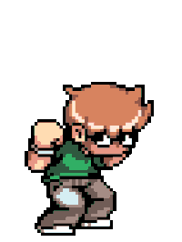

<!-- Intro -->

      <h1 align="center" style="margin-top: 1.5em; font-size: 25px; font-weight: bolder;">
            VICTOR CARDOSO LIMA
      </h1>
      
Oi, tudo bom? 😄 Este é um breve resumo sobre mim,  o que faço e metas que vou alcançar!

      

            

                  
            

      

        

<!-- About me -->

      <h1 align="center" style="margin-top: 1.5em; font-weight: bolder;">
            Sobre mim 💬
      </h1>
      <ul style="font-size: 18px;">
            <li>Brasileiro</li>
            <li>19 anos</li>
            <li>Estudante</li>
            <li>Entusiasta em desenvolvimento web e mobile</li>
      </ul>
      

            🚀 Atualmente cursando <strong>Análise e Desenvolvimento de Sistemas</strong> e me dedicando a alcançar metas que estabeleci para minha vida profissional!
      

      

            Hoje invisto, de forma extracurrilar, em ampliar meus conhecimentos em desenvolvimento web a aperfeiçoar meu nível em JavaScript e seus principais frameworks – e confesso que meu favorito (pelo menos até o momento) é o React.
      

      

            <strong>Curiosidade sobre mim: </strong>também sou um ótimo desenhista e já cheguei até a fazer um curso na área, me especializando em mangá! 👻
      

        

<!-- Interests -->

      <h1 align="center" style="margin-top: 2.5em; font-weight: bolder;">
            ⭐ Atualmente interessado em:
      </h1>
      

            

                  
                  
                  
                  
                  
                  
                  
            

      

        

<!-- Contact -->

      <h1 align="center" style="margin-top: 2.5em; font-weight: bolder;">
            Como entrar em contato comigo?
      </h1>
      

            
      

      

            
      

